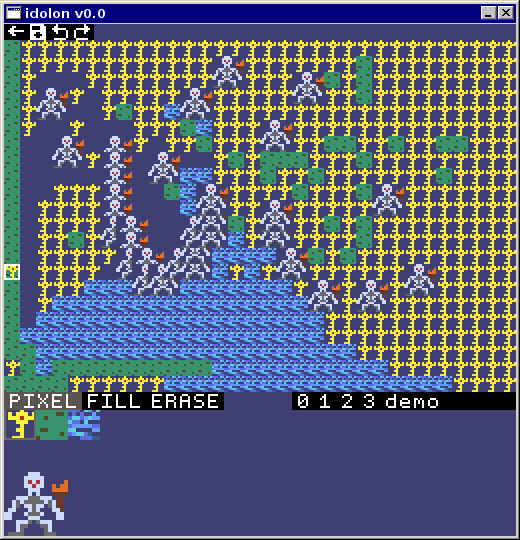
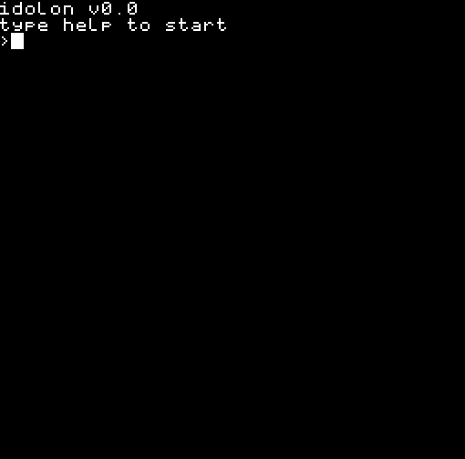

# idolon [WIP]
An emulator for a nonexistent system  

### Installation

### Game API

### Development
1. Download the source using git
`git clone https://github.com/138paulmiller/idolon.git`
2. Navigate to project root
`cd idolon`

##### Linux
1. Install 3rd Party Libraries using `sudo make install` . This is only required to do once.
2. Build the executable with `make`, of which will generate a executable *idolon*. 

##### Windows
1. Install [Visual Studio 2019](https://visualstudio.microsoft.com/downloads/)
2. Open the solution using VS2019 `idolon.sln`
3. To build and run, select *Local Windows Debugger*

## Logs 

##### v0.0
 
